# 🏺 ArtesaniasApp — Tienda de Alfarería con Wear OS

Aplicación Android completa para tienda de artesanías y alfarería, con módulo para Wear OS que notifica al administrador sobre stock bajo y compras grandes.

---
# Información del equipo

**Integrantes:**
- Miguel Ángel Álvarez Ibarra
- Claudio Ángel Huerta Ducoing
- Pedro Uriel Perez Monzón

**Grupo:** GIDS6092

---

## 🎯 Objetivo

Desarrollar una aplicación Android para la gestión y venta de artesanías y productos de alfarería que permita a los clientes explorar el catálogo, realizar compras y consultar sus pedidos, mientras que los administradores puedan gestionar productos, usuarios e inventario. Además, integrar un módulo para Wear OS que facilite el monitoreo del negocio mediante notificaciones de stock bajo, compras importantes y acciones remotas desde un reloj inteligente.

---

## 📚 READMEs por módulo

Este README cubre el proyecto completo. Cada módulo tiene su propio README con el detalle de su stack, estructura interna y pasos de instalación específicos:

| Módulo | README |
|---|---|
| 📱 Phone (`app/`) | [`app/README.md`](app/README.md) |
| ⌚ Wear OS (`wear/`) | [`wear/README.md`](wear/README.md) |
| 📺 Android TV (`tv/`) | [`tv/README.md`](tv/README.md) |

---

## 📋 Características

### 📱 Módulo Phone (app)
- **Autenticación**: Login y registro con roles (Admin / Cliente)
- **Tienda**: Catálogo con búsqueda en tiempo real, carrito de compras
- **Mis Órdenes**: Historial de compras del cliente
- **Cámara dual**: Foto de producto (CameraX) + escáner QR para parear reloj (ZXing)
- **Panel de Admin**:
  - Gestión de productos (crear, editar, stock)
  - Gestión de usuarios (crear, activar/desactivar)
  - Dashboard con estadísticas en tiempo real
- **Comunicación Wear OS**: Notificaciones automáticas via Wearable Data Layer

### ⌚ Módulo Wear OS (wear)
- **Alertas de stock bajo** (≤ 5 unidades): vibración corta + notificación
- **Alertas de compra grande** (> $500 MXN): vibración larga + notificación informativa
- **Confirmación de compra muy grande** (> $1000 MXN): requiere confirmación desde el reloj
- **Respuesta bidireccional**: el admin puede agregar stock y confirmar órdenes directamente desde el reloj

### 📺 Módulo Android TV (tv)
- **Pantalla de negocio**: muestra en una pantalla grande, en vivo, lo que pasa en la tienda — pensada para tenerla siempre visible en el mostrador/taller
- **Catálogo**: cuadrícula de productos activos con precio y stock (⚠️ si es bajo)
- **Ventas**: gráfica de más vendidos de la semana + tabla de compras recientes
- **Talleres**: mapa de los talleres artesanales del catálogo
- **Alerta de compra grande**: overlay que aparece encima de cualquier pantalla cuando el cliente hace una compra grande, igual que la alerta del reloj
- Es un **receptor pasivo**: no tiene base de datos propia, todo lo que muestra se lo manda el módulo `app` por socket TCP (ver [Comunicación Teléfono ↔ TV](#-comunicación-teléfono--tv))

📄 Cada módulo tiene su propio README con más detalle de stack y estructura: [`app/README.md`](app/README.md) · [`wear/README.md`](wear/README.md) · [`tv/README.md`](tv/README.md)

---

## 🛠️ Requisitos

| Herramienta | Versión mínima |
|---|---|
| Android Studio | Hedgehog 2023.1.1+ |
| JDK | 17+ |
| Android SDK | API 26+ (Android 8.0) |
| Wear OS en emulador | API 28+ |
| Kotlin | 1.9.22 |
| Gradle | 8.2.2 |

---

## 🚀 Instalación

### 1. Abrir en Android Studio
```
File → Open → Seleccionar carpeta ArtesaniasApp/
```

### 2. Sincronizar Gradle
```
File → Sync Project with Gradle Files
```
*(o clic en "Sync Now" cuando aparezca el banner)*

### 3. Instalar módulo phone
```
Run → Run 'app'    # En dispositivo físico o emulador API 26+
```

### 4. Instalar módulo Wear OS
```
Run → Run 'wear'   # En reloj emparejado o emulador Wear OS
```

> **Nota**: Para emulador Wear OS, primero empareja el AVD del reloj con el AVD del teléfono en el Wear OS Emulator Pairing Assistant.

### 5. Instalar módulo Android TV
```
Run → Run 'tv'   # En dispositivo/emulador de Android TV (API 26+)
```

> Si no tienes un AVD de TV: Android Studio → Device Manager → Create Device → categoría **TV**.
> La TV necesita, además, el "puente" de comunicación con el teléfono para recibir datos — ver [Cómo generar el puente de comunicación de la TV](#-cómo-generar-el-puente-de-comunicación-de-la-tv) más abajo. Sin ese puente, la app de TV arranca pero se queda vacía (no tiene datos que mostrar).

> Los tres módulos necesitan la misma `MAPS_API_KEY` en `local.properties` (raíz del proyecto) para el mapa de talleres.

---

## 👤 Credenciales por defecto

| Rol | Email | Contraseña |
|---|---|---|
| Admin | admin@artesanias.mx | Admin123 |
| Cliente | cliente@artesanias.mx | Cliente123 |

---

## 🏗️ Arquitectura

```
ArtesaniasApp/
├── app/                          # Módulo teléfono
│   └── src/main/
│       ├── java/com/artesanias/app/
│       │   ├── data/
│       │   │   ├── local/        # Room (DAOs, Database)
│       │   │   ├── model/        # Entidades y data classes
│       │   │   ├── remote/       # WearableDataListenerService
│       │   │   └── repository/   # Repositorios con lógica de negocio
│       │   ├── di/               # Módulos Hilt
│       │   ├── ui/
│       │   │   ├── admin/        # Fragments de administración
│       │   │   ├── auth/         # Login y Registro
│       │   │   ├── camera/       # CameraX + QR scan
│       │   │   ├── shared/       # Adapters compartidos
│       │   │   └── store/        # Tienda, carrito, órdenes
│       │   ├── util/             # SessionManager, HashUtil, QRUtil
│       │   ├── ArtesaniasApplication.kt
│       │   ├── MainActivity.kt
│       │   └── ViewModels.kt
│       └── res/
│           ├── layout/           # 15 layouts (fragments + items + dialogs)
│           ├── navigation/       # nav_graph.xml
│           ├── menu/             # menu_admin.xml, menu_cliente.xml
│           ├── drawable/         # Iconos vectoriales
│           └── values/           # strings, themes, colors
│
├── wear/                         # Módulo reloj
│   └── src/main/
│       ├── java/com/artesanias/wear/
│       │   ├── data/
│       │   │   └── PhoneMessageListenerService.kt
│       │   ├── presentation/
│       │   │   └── Activities.kt  # Main, StockList, StockAlert, CompraAlert, StockResultado
│       │   └── WearApplication.kt
│       └── res/
│           ├── layout/            # 5 layouts de actividades
│           └── values/            # strings, themes
│
└── tv/                           # Módulo Android TV
    └── src/main/
        ├── java/com/artesanias/tv/
        │   ├── data/
        │   │   ├── Modelos.kt      # Data classes locales (sin Room, la TV no persiste nada)
        │   │   └── TvDataStore.kt  # Estado en memoria (StateFlow) para las 3 pantallas
        │   ├── net/
        │   │   └── TvServer.kt     # Servidor TCP: recibe JSON del teléfono, puerto 8766
        │   ├── ui/
        │   │   ├── ProductosFragment.kt
        │   │   ├── VentasFragment.kt   # Gráfica MPAndroidChart + tabla de compras
        │   │   └── MapaFragment.kt     # WebView con Google Maps JS
        │   ├── MainActivity.kt        # Riel de navegación + overlay de compra grande
        │   └── TvApplication.kt
        └── res/
            ├── layout/
            └── values/
```

Cada módulo tiene su propio README con el detalle completo de su estructura y dependencias: [`app/README.md`](app/README.md) · [`wear/README.md`](wear/README.md) · [`tv/README.md`](tv/README.md)

### Patrón: MVVM + Clean Architecture (módulo `app`)

```
UI (Fragment) ←→ ViewModel ←→ Repository ←→ DAO / TvDataSender / WearableDataListenerService
```

`wear` y `tv` no siguen este patrón completo porque no tienen base de datos propia: son consumidores/emisores de mensajes que reaccionan a lo que manda `app` (`wear`) o le mandan directo lo que reciben a las vistas (`tv`).

**Stack tecnológico:**
- **DI**: Hilt 2.50 (`app`, `wear`)
- **Base de datos**: Room 2.6.1 con Flow/LiveData (solo `app` — `wear` y `tv` no persisten datos)
- **Coroutines**: kotlinx.coroutines 1.7.3
- **Navegación**: Navigation Component 2.7.6 (solo `app`; `wear` y `tv` cambian de Activity/Fragment manualmente)
- **Cámara**: CameraX 1.3.1
- **QR**: ZXing Core 3.5.2 + zxing-android-embedded 4.3.0
- **Imágenes**: Glide 4.16.0
- **Wear OS**: Wearable Data Layer (MessageClient + DataClient)
- **TV**: socket TCP propio (JSON por línea) + MPAndroidChart v3.1.0 para la gráfica de ventas

---

## 🔗 Comunicación Teléfono ↔ Reloj

### Teléfono → Reloj (paths de mensajes)

| Path | Datos | Acción en reloj |
|---|---|---|
| `/alerta/stock` | `"productoId:nombre:stock"` | Vibra + abre StockAlertActivity |
| `/alerta/compra-grande` | `"mensaje de compra"` | Vibra + abre CompraAlertActivity |
| `/stock/actualizado` | `"confirmación"` | Notificación simple |
| `/orden/confirmada` | `"confirmación"` | Notificación simple |

### Reloj → Teléfono (respuestas)

| Path | Datos | Acción en teléfono |
|---|---|---|
| `/stock/agregar` | `"productoId:cantidad"` | Agrega stock al producto en BD |
| `/orden/confirmar` | `"ordenId"` | Confirma la orden en BD |
| `/ping` | `"hola"` | Responde con `/ping/pong` |

---

## 🔗 Comunicación Teléfono ↔ TV

A diferencia del reloj, la TV **no** usa Wearable Data Layer (Android TV no la soporta). La comunicación es en un solo sentido (teléfono → TV) mediante un **servidor de sockets TCP propio**: el teléfono es el cliente, la TV es el servidor.

- **Puerto:** `8766`
- **Protocolo:** una línea de JSON por mensaje, terminada en `\n`. El campo `"tipo"` indica qué es cada mensaje.
- **Emisor:** `TvDataSender` (módulo `app`, `data/remote/TvDataSender.kt`)
- **Receptor:** `TvServer` (módulo `tv`, `net/TvServer.kt`)

| Tipo (`"tipo"`) | Cuándo se manda | Pantalla que actualiza |
|---|---|---|
| `productos` | Al entrar a la Tienda o cambiar el catálogo | Catálogo |
| `mas_vendidos` | Al calcular el ranking de ventas | Ventas |
| `compras_semana` | Al registrarse una compra | Ventas |
| `compra_grande` | Al confirmarse una compra > $500 MXN | Overlay sobre cualquier pantalla |

La conexión es **best-effort**: si la TV no está alcanzable, `TvDataSender` solo registra un log y la operación del teléfono (crear orden, actualizar stock) continúa sin verse afectada — la TV nunca puede bloquear el flujo normal de la app.

---

## 🌉 Cómo generar el puente de comunicación de la TV

Este es el paso que casi siempre se olvida y hace que la TV se vea "vacía". El socket usa `127.0.0.1` (loopback) en vez de la IP de red de la PC porque **el router bloquea, por aislamiento de clientes WiFi, la conexión iniciada desde el celular hacia la PC** (el sentido contrario sí funciona, pero no sirve aquí). La solución es túnel por **cable USB** con `adb reverse`/`adb forward`, evitando el router por completo.

### Con teléfono físico + emulador de TV

```bash
# 1. Túnel desde el teléfono (por USB) hacia la PC
adb -s <serial_del_telefono> reverse tcp:8766 tcp:8766

# 2. Túnel desde la PC hacia el emulador de TV
adb -s <serial_del_emulador_tv> forward tcp:8766 tcp:8766
```

> `adb devices` te da los seriales. El del teléfono físico se ve como algo tipo `R58N10KXLMF`; el del emulador, como `emulator-5554`.

### Si usas dos emuladores (teléfono + TV, sin dispositivo físico)

No hace falta ningún túnel: ambos emuladores comparten la misma máquina host, así que `127.0.0.1:8766` desde el emulador del teléfono ya no llega directo al emulador de la TV — en ese caso sí conviene usar la IP de host del emulador (`10.0.2.2`) en vez de `127.0.0.1`, o replicar el mismo esquema de `adb forward` apuntando ambos emuladores al mismo puerto de la PC.

### Cómo saber si el puente está bien armado

- En Logcat del módulo **`app`**, busca `TvDataSender`: debe decir `"Enviado a la TV correctamente"` y no `"No se pudo enviar a la TV"`.
- En Logcat del módulo **`tv`**, busca `TvServer`: debe decir `"Escuchando en puerto 8766"` al arrancar, y luego líneas de mensajes recibidos.
- El túnel **se pierde cada vez que se desconecta/reconecta el cable USB** o se reinicia el emulador de TV — hay que repetir los dos comandos `adb` cada vez que eso pase, justo antes de hacer cualquier prueba o demo.

---

## 📷 Cómo parear el reloj

1. En la app del teléfono, inicia sesión como **Admin**
2. En el menú inferior, ve a **Cámara**
3. Selecciona **Modo QR** (botón inferior)
4. En el reloj, abre la app → toca **"Ver QR de conexión"**
5. Escanea el QR mostrado en el reloj con la cámara del teléfono
6. El nodo ID queda registrado para comunicación directa

---

## 🖼️ Capturas de pantalla

### 📱 Módulo Phone

| Login | Registro | Panel de Admin |
|---|---|---|
| 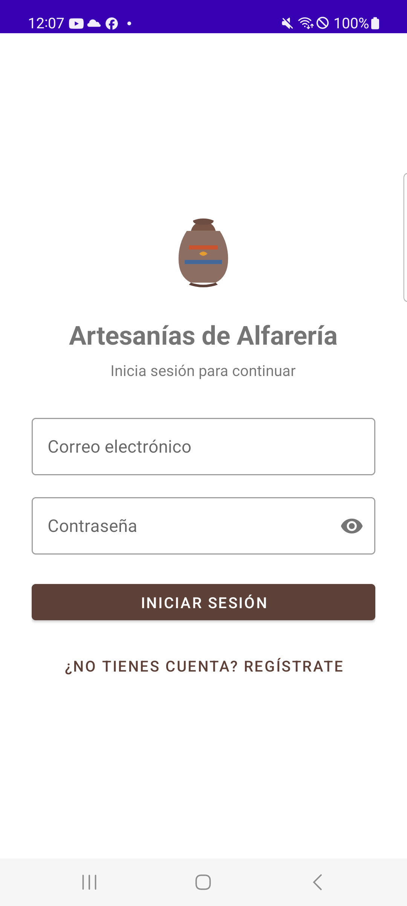 | 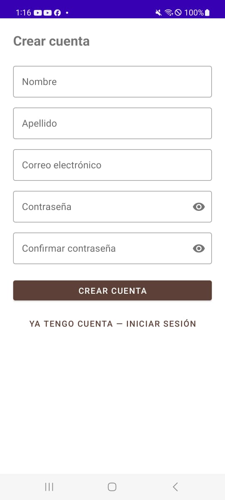 | 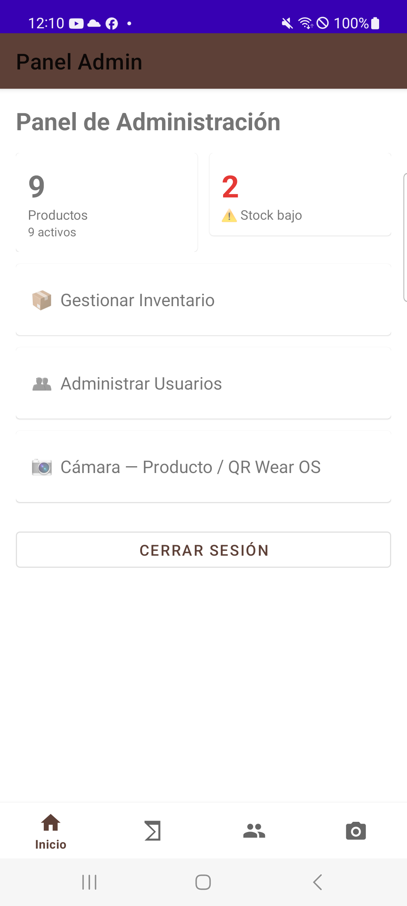 |

| Tienda (Cliente) | Carrito | Mis Órdenes |
|---|---|---|
| 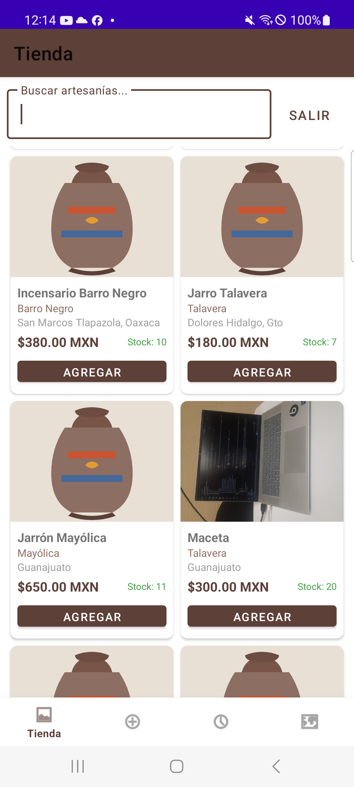 | 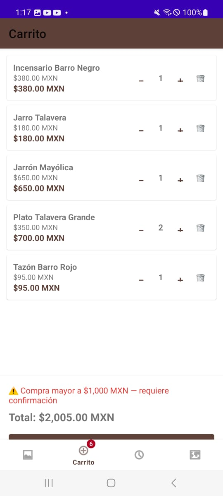 | 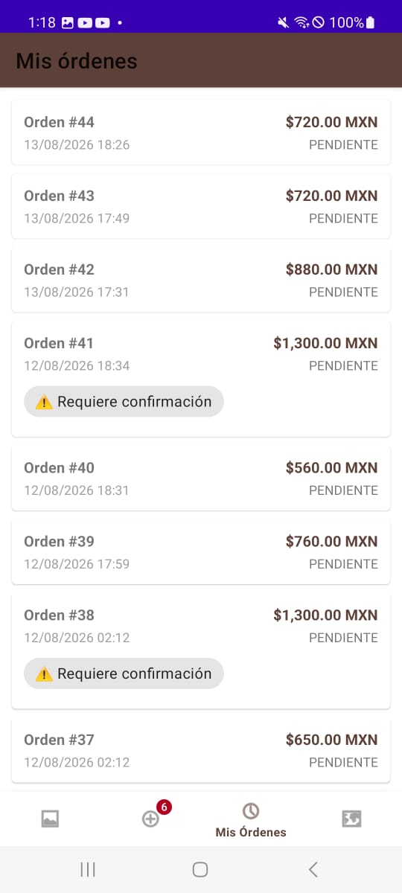 |

| Talleres (mapa) | Inventario (Admin) | Editar producto |
|---|---|---|
| 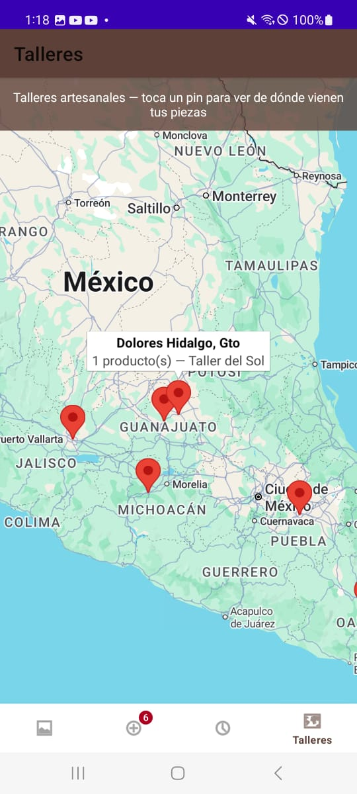 | 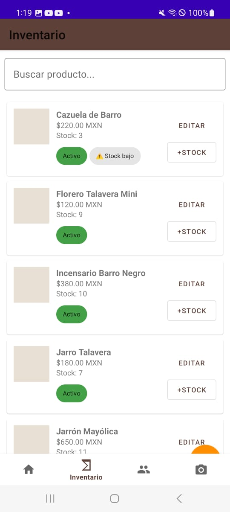 | 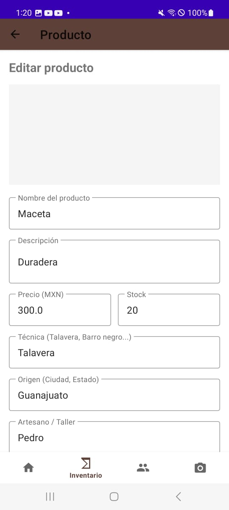 |

| Usuarios (Admin) | Cámara — Fotografiar producto | Nuevo producto (con foto) |
|---|---|---|
| 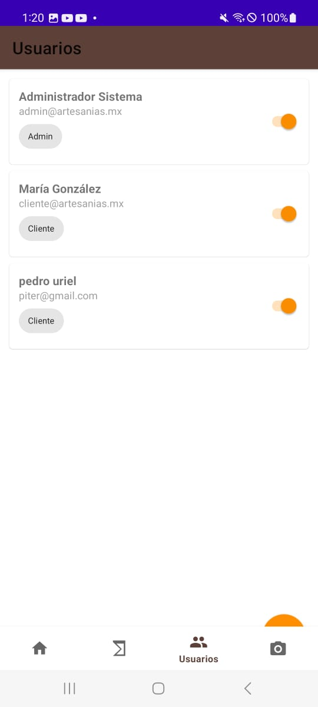 | 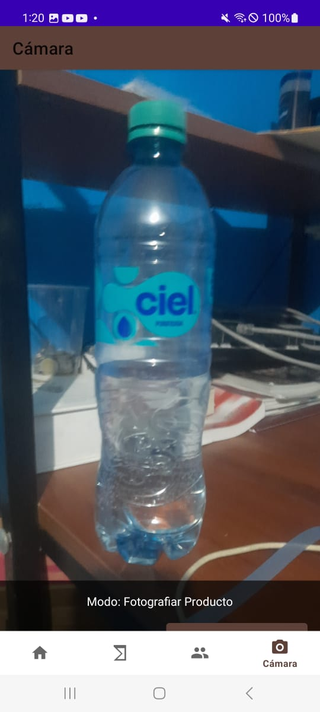 | 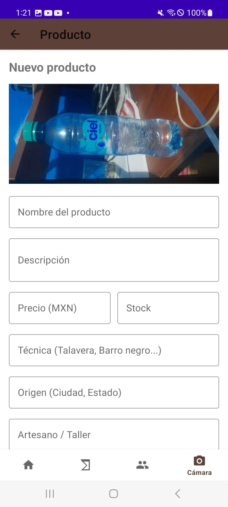 |

### 📺 Módulo Android TV

| Catálogo | Ventas | Talleres (mapa) |
|---|---|---|
| 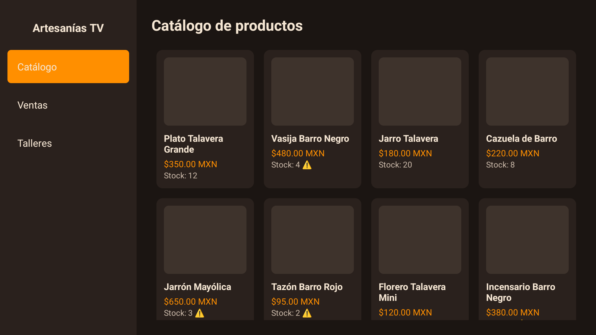 | 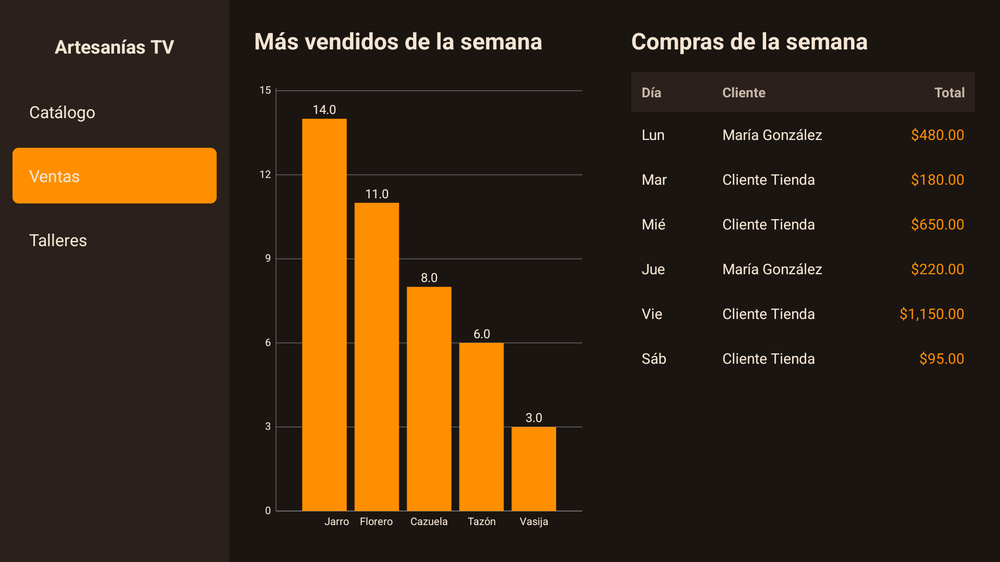 | 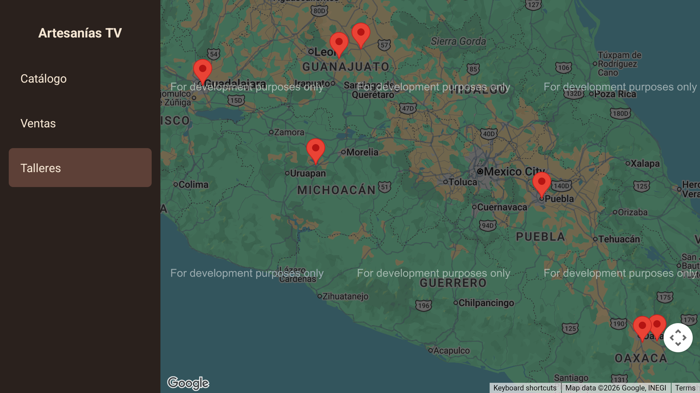 |

| Alerta de compra grande (overlay) |
|---|
| 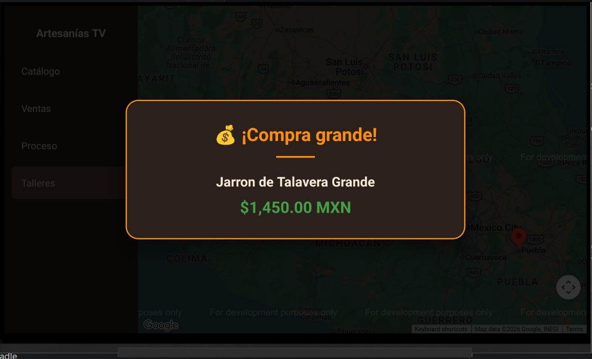 |

### ⌚ Módulo Wear OS

| Pantalla principal | Lista de stock bajo | Alerta de stock bajo |
|---|---|---|
| 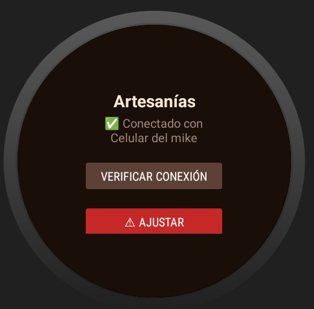 | 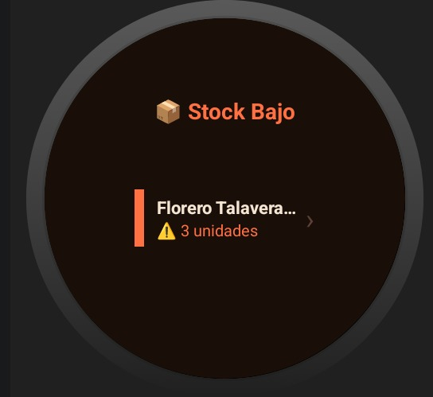 | 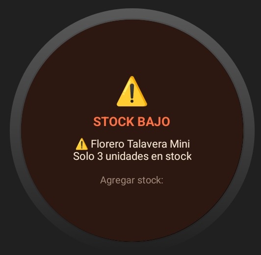 |

| Agregar stock | Alerta de compra grande | Confirmar compra |
|---|---|---|
| 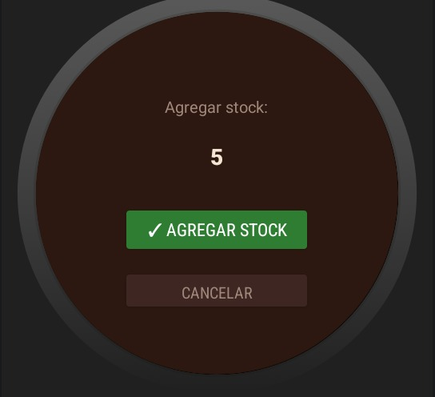 | 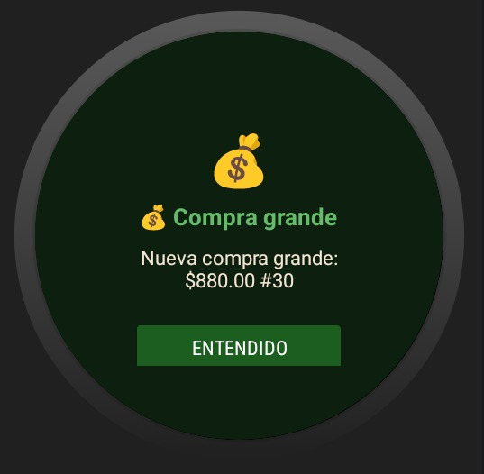 | 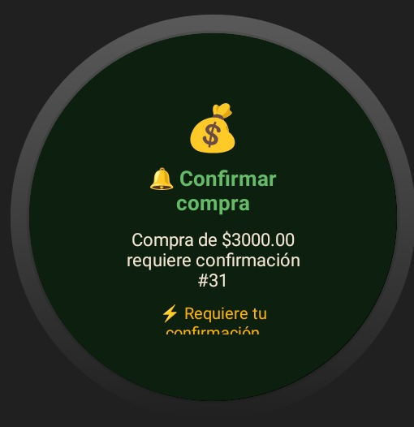 |

| Confirmar / Desestimar | Orden confirmada | Stock suficiente |
|---|---|---|
| 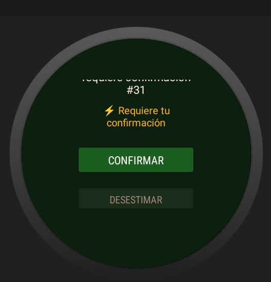 | 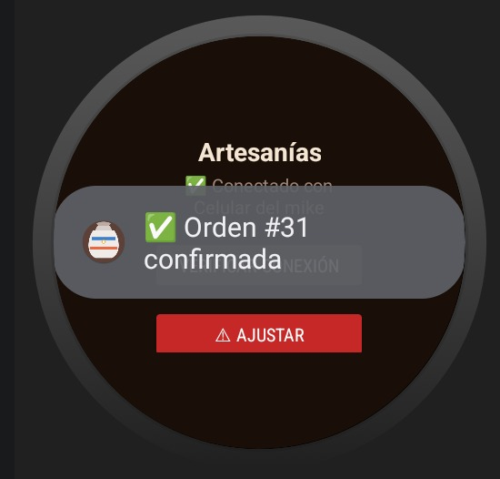 | 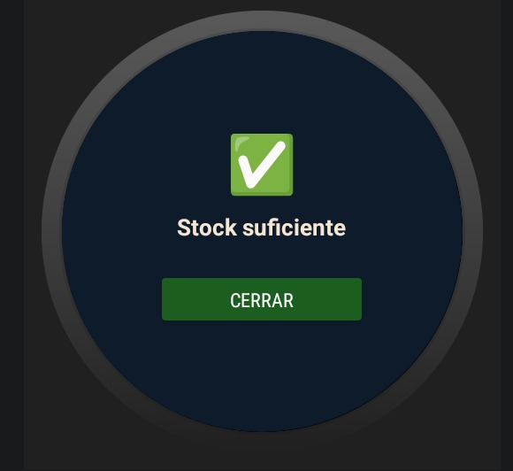 |

> Más capturas disponibles en la carpeta [`evidencias/`](evidencias/).

---

## 🎨 Paleta de colores

| Color | Hex | Uso |
|---|---|---|
| Marrón terracota | `#5D4037` | Color primario / botones |
| Marrón oscuro | `#3E2723` | Color primario dark |
| Crema | `#F5E6D3` | Textos principales |
| Naranja alerta | `#FF7043` | Alertas de stock |
| Verde compra | `#66BB6A` | Confirmaciones de venta |
| Ámbar | `#FFB300` | Avisos de confirmación requerida |

---

## 🗄️ Base de datos

### Datos pre-cargados

**Categorías:** Talavera Poblana, Barro Negro, Mayólica, Alfarería Utilitaria

**Productos de ejemplo:**
- Jarrón de Talavera Grande ($850 MXN, stock: 3 ⚠️)
- Platos de Talavera Set x6 ($650 MXN, stock: 8)
- Olla de Barro Negro ($420 MXN, stock: 12)
- Cazuela de Barro ($280 MXN, stock: 2 ⚠️)
- Florero de Mayólica ($380 MXN, stock: 7)
- Jarra Decorativa ($520 MXN, stock: 5 ⚠️)
- Tazón de Cerámica ($180 MXN, stock: 20)
- Maceta Artesanal ($240 MXN, stock: 15)

*Los productos marcados con ⚠️ tienen stock bajo y generarán alertas al reloj.*

### Umbrales de negocio

| Condición | Umbral | Acción |
|---|---|---|
| Stock bajo | ≤ 5 unidades | Alerta al reloj (vibración corta) |
| Compra grande | > $500 MXN | Notificación al reloj |
| Compra muy grande | > $1,000 MXN | Alerta urgente + confirmación requerida |

---

## 🔐 Seguridad

- Contraseñas hasheadas con **SHA-256** (demo)
- Control de acceso por rol en Navigation (destino inicial dinámico)
- Validación de email único al registrar
- Usuarios desactivados no pueden iniciar sesión

> **Producción**: Se recomienda migrar a BCrypt con salt para el hash de contraseñas.

---

## 📝 Notas de desarrollo

- El módulo Wear OS usa `ComponentActivity` en todas sus pantallas (no Navigation Component) para máxima compatibilidad con Wear OS 2.x y 3.x
- `lifecycleScope` está disponible desde `androidx.activity:activity-ktx`
- La comunicación Wear usa `MessageClient` (no DataClient) para comandos y respuestas instantáneas
- Los layouts Wear usan `BoxInsetLayout` para adaptarse a pantallas redondas y cuadradas
- El módulo TV no usa Hilt ni Room: es un receptor pasivo (`TvServer` + `TvDataStore` como `object`), no necesita inyección de dependencias ni persistencia propia

---

## 🐛 Problemas conocidos / TODOs

### ✅ Ya corregidos (dejamos el registro para que quien retome el proyecto sepa qué se rompía y por qué)

- **Colapso al alternar Admin ↔ Cliente en la misma sesión de la app**: `AuthViewModel.loginResult`/`registerResult` eran `LiveData` "sticky" — un Fragment que volvía a observar recibía el resultado *anterior* ya cacheado y reaccionaba como si acabara de iniciar sesión otra vez. Se corrigió con `LiveData` nullable + un método `consumir...()` explícito que limpia el valor tras usarlo.
- **El menú inferior se quedaba mostrando las opciones de Cliente después de iniciar sesión como Admin (y viceversa)**: `AdminDashboardFragment` usaba un `AuthViewModel` con scope de Fragment (`by viewModels()`) en vez del compartido con el resto de la app (`by activityViewModels()`), y además `MainActivity` decidía si reconstruir el menú con una bandera (`menuRoleShown`) que se desincronizaba entre logout/login. Se corrigió unificando el scope del ViewModel y reemplazando la bandera por una verificación directa contra el menú actualmente inflado.
- **"Cerrar sesión" no hacía nada visible desde el panel de Admin**: consecuencia del mismo bug del ViewModel con scope de Fragment — el botón sí ejecutaba `cerrarSesion()`, pero sobre una instancia del ViewModel que no era la que controlaba la navegación real.
- **El carrito se quedaba en un estado inconsistente tras completar una compra**: corregido junto con la validación de stock en `crearOrden` (repositorio de órdenes).
- **La app dependía de que la TV estuviera conectada para completar una orden**: se aisló el envío a la TV (`TvDataSender`) en su propio try/catch, best-effort — si la TV no responde, la orden se crea igual.
- **Etiquetas encimadas en la gráfica de "más vendidos" de la TV**: `VentasFragment.acortar()` recorta el nombre del producto a su primera palabra para que no se empalmen las etiquetas del eje X.
- **El puerto del socket de la TV cambió de 8765 a 8766** (ver [`TvServer.PUERTO`](tv/src/main/java/com/artesanias/tv/net/TvServer.kt) / [`TvDataSender.PUERTO`](app/src/main/java/com/artesanias/app/data/remote/TvDataSender.kt)) — si encuentras documentación o capturas viejas con 8765, están desactualizadas.
- Se quitó una pantalla "Proceso" (reproducía un video) que existía en el módulo TV y ya no forma parte del flujo.

### ⚠️ Conocidos, no corregidos

- **`wear/build.gradle` usa `applicationId "com.artesanias.app"`**, el mismo que el módulo `app`, en vez de algo distinto como `com.artesanias.wear`. No causa fallas porque los módulos se instalan en dispositivos separados (teléfono vs. reloj), pero es inconsistente con el resto del proyecto y puede confundir al revisar los tres `build.gradle` juntos.
- El túnel `adb reverse`/`adb forward` de la TV (puerto 8766) se pierde cada vez que se desconecta el cable USB del teléfono o se reinicia el emulador de TV, y hay que rearmarlo a mano — ver [Cómo generar el puente de comunicación de la TV](#-cómo-generar-el-puente-de-comunicación-de-la-tv).
- El mapa de talleres (WebView + Google Maps JS) puede mostrar el aviso *"This page can't load Google Maps correctly"* si la API key no tiene facturación habilitada o le faltan restricciones correctas — el mapa y los pines igual se renderizan (es una marca de agua de "for development purposes only"), pero conviene una key de producción para la entrega final.

### TODOs

- [ ] Migrar hash de contraseñas a BCrypt con salt
- [ ] Implementar Firebase Cloud Messaging como canal alternativo al Wear Data Layer
- [ ] Agregar tests unitarios para los Repositorios
- [ ] Implementar paginación (Paging 3) para el catálogo grande
- [ ] Agregar exportación de reportes de ventas en CSV
- [ ] Corregir el `applicationId` del módulo `wear`
